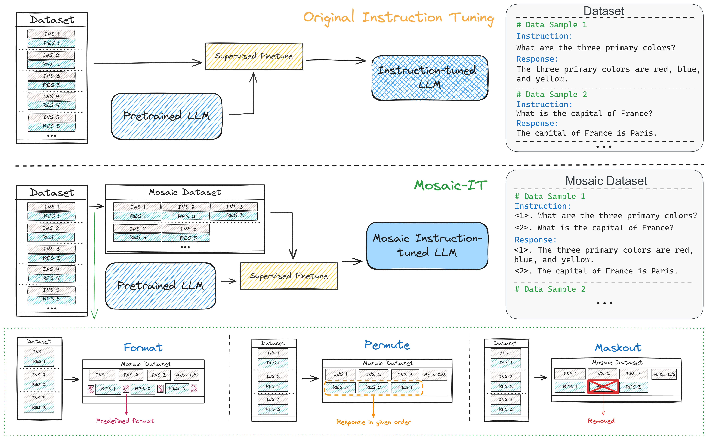

# Mosaic IT: Enhancing Instruction Tuning with Data Mosaics

[Mosaic IT: Enhancing Instruction Tuning with Data Mosaics](https://arxiv.org/abs/2405.13326) 

<p align="center" width="40%">
<a ></a>
</p>

This is the repo for the Mosaic-IT project, which introduces an augmentation method for Instruction Tuning, which concurrently **improves the LLM performances** and **lowers the training expenses**. 

(Feel free to email minglii@umd.edu for any questions or feedback.)

## News
- [2024/05] We initialized the Mosaic-IT repo.

## Contents
- [Overview](#overview)
- [Highlights](#highlights)
- [Install](#install)
- [Run Code](#run-code)
- [ToDo](#todo)
- [Citation](#citation)
- [Our Related Works](#our-related-works)

## Overview

Finetuning large language models with a variety of instruction-response pairs has enhanced their capability to understand and follow instructions.
Current instruction tuning primarily relies on teacher models or human intervention to generate and refine the instructions and responses, which are costly, non-sustainable, and may lack diversity. 
In this paper, we introduce Mosaic Instruction Tuning (Mosaic-IT), a human/model-free method that can efficiently create rich and diverse augmentations from existing instruction tuning data to enhance the finetuned LLM.
Mosaic-IT randomly concatenates multiple instruction data into one and trains the model to produce the corresponding responses with predefined higher-level meta-instructions to strengthen its multi-step instruction-following and format-following skills. 
Our extensive evaluations demonstrate a superior performance and training efficiency of Mosaic-IT, which achieves consistent performance improvements over various benchmarks and an 80% reduction in training costs compared with original instruction tuning.

<p align="center" width="90%">
<a ></a>
</p>

Illustration of Mosaic-IT. The **upper** section represents the original Instruction Tuning method. In the **middle** is our method with the Primary Mosaic strategy, which concatenates instructions and corresponding responses as an augmentation for better Instruction Tuning. On the right are corresponding data examples of each method. The **lower** section illustrates the three Auxiliary Mosaic Strategies for Mosaic-IT. 

## Highlights

* We **extend the instruction tuning process into arbitrarily following multiple instructions**, rather than one instruction at a time, which dramatically digs out the potential of the existing instruction tuning dataset.
* Our Mosaic-IT (1) **achieves better performances** on various benchmarks, with (2) **80% reduction on training cost** (3) **without using any extra models**。
* Our method is **a potential attempt to alleviate the memorizing effects** during training, see Further Discussion for details.
* The Mosaic Strategies and Predefined Rules in our method **can be easily further extended**, potentially further improve the Mosaic-IT performance. 

## Install

Install the dependencies with `pip install -r requirements.txt`

Note: The use of Mosaic-IT only needs the ```transformers``` package, thus if you are using a different code base with ```transformers``` installed, you can directly run the code and manually install the missing packages.

## Run Code

```
python Mosaic-IT/mosaic_main.py \
    --data_path data/alpaca_gpt4_data.json \
    --save_path alpaca_gpt4_data_mosaicked.json \
    --model_name_or_path meta-llama/Llama-2-7b-hf \
    --epo_num 4 \
    --wrap_mode uniform \
    --wrap_max_num 10 \
    --version both
```

```--data_path```: Input data, in alpaca format. <br>
```--save_path```: Save data path. <br>
```--model_name_or_path```: The model used to calculate the token counts. <br>
```--epo_num```: The times of random mosaic process to be run. <br>
```--wrap_mode```: How to decide the distribution of the number of instructions. <br>
```--wrap_max_num```: Max number of instructions. <br>
```--version```: Mosaic Strateties. <br>

## Training

We use the prompt and code base from [FastChat](https://github.com/lm-sys/FastChat):

```
A chat between a curious user and an artificial intelligence assistant. The assistant gives helpful, detailed, and polite answers to the user's questions. USER: Hi ASSISTANT: Hello.</s>USER: Who are you? ASSISTANT: I am ...</s>......
```

## ToDo
- [x] Initialize the repo.
- [x] Release paper on Arxiv.
- [ ] Release data and model.

## Citation

Please consider citing our papers if you think our codes, data, or models are useful. Thank you! <br>

```
@misc{li2024mosaicitenhancinginstruction,
      title={Mosaic IT: Enhancing Instruction Tuning with Data Mosaics}, 
      author={Ming Li and Pei Chen and Chenguang Wang and Hongyu Zhao and Yijun Liang and Yupeng Hou and Fuxiao Liu and Tianyi Zhou},
      year={2024},
      eprint={2405.13326},
      archivePrefix={arXiv},
      primaryClass={cs.CL},
      url={https://arxiv.org/abs/2405.13326}, 
}

@misc{li2024rulerimprovingllmcontrollability,
      title={RuleR: Improving LLM Controllability by Rule-based Data Recycling}, 
      author={Ming Li and Han Chen and Chenguang Wang and Dang Nguyen and Dianqi Li and Tianyi Zhou},
      year={2024},
      eprint={2406.15938},
      archivePrefix={arXiv},
      primaryClass={cs.CL},
      url={https://arxiv.org/abs/2406.15938}, 
}
```

## Our Related Works

If you are interested in **Data Selection** for Instruction Tuning, please see [Cherry_LLM](https://github.com/MingLiiii/Cherry_LLM) and [Superfiltering](https://github.com/tianyi-lab/Superfiltering). <br>
If you are interested in **human/LLM-free Data Augmentation** for Instruction Tuning, please see [Mosaic-IT](https://github.com/tianyi-lab/Mosaic-IT) and [RuleR](https://github.com/MingLiiii/RuleR). <br>
If you are interested in **Data Improvement** for Instruction Tuning, please see [Reflection_Tuning](https://github.com/tianyi-lab/Reflection_Tuning). <br>
If you are interested in **Knowledge Distillation** in the LLM era, please see this [Survey](https://github.com/Tebmer/Awesome-Knowledge-Distillation-of-LLMs). <br>


